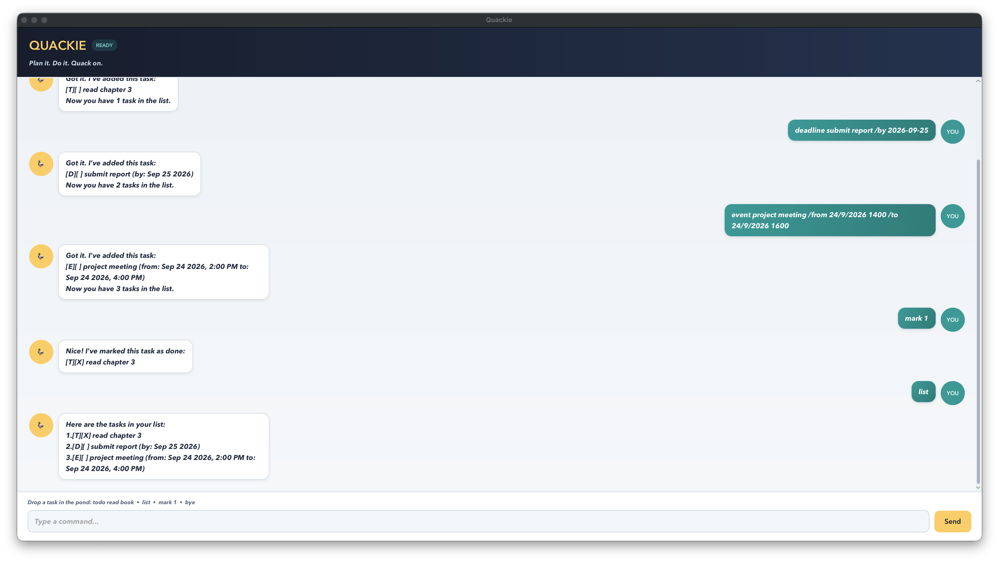

# Quackie User Guide

Quackie is a desktop task manager with a friendly duck personality. It keeps todos, deadlines, and events in one place, saves changes automatically, and accepts short keyboard commands through its chat-style interface.



## Getting started

1. Install Java 25.
2. Download `quackie.jar` and place it in a folder where Quackie may create a `data` subfolder.
3. Open a terminal in that folder and run:

   ```shell
   java -jar quackie.jar
   ```

4. Type a command in the input box and press <kbd>Enter</kbd> or select **Send**.

Quackie saves tasks to `data/quackie.txt` whenever the task list changes and reloads them the next time it starts. The `data` folder and file are created automatically when needed.

## Reading the task list

Each task starts with a type and status indicator:

- `[T]` is a todo.
- `[D]` is a deadline.
- `[E]` is an event.
- `[ ]` means the task is not done, while `[X]` means it is done.

Task numbers shown by `list` are used by commands such as `mark`, `delete`, and `update`.

## Command summary

| Action | Format | Example |
| --- | --- | --- |
| Add a todo | `todo DESCRIPTION` | `todo read chapter 3` |
| Add a deadline | `deadline DESCRIPTION /by DATE_OR_TIME` | `deadline submit report /by 2026-09-18` |
| Add an event | `event DESCRIPTION /from START /to END` | `event project meeting /from 18/9/2026 1400 /to 18/9/2026 1600` |
| List tasks | `list` | `list` |
| Find tasks | `find KEYWORD` | `find report` |
| Mark a task done | `mark INDEX` | `mark 2` |
| Mark a task not done | `unmark INDEX` | `unmark 2` |
| Delete a task | `delete INDEX` | `delete 3` |
| Update a task | `update INDEX TASK_COMMAND` | `update 1 deadline read chapter 3 /by 2026-09-20` |
| Exit Quackie | `bye` | `bye` |

Extra spaces at the beginning, end, or between command words are ignored. Command keywords must be lower case.

## Adding tasks

### Adding a todo

Use `todo DESCRIPTION` for a task without a date or time.

```text
todo borrow a library book
```

Quackie adds the task as not done:

```text
[T][ ] borrow a library book
```

### Adding a deadline

Use `deadline DESCRIPTION /by DATE_OR_TIME` for work that must be completed by a particular point.

Quackie understands these structured formats:

- `yyyy-MM-dd` for a date, such as `2026-09-18`.
- `d/M/yyyy HHmm` for a date and 24-hour time, such as `18/9/2026 2359`.

A structured date is displayed in a friendlier form. For example:

```text
deadline submit report /by 2026-09-18
```

is displayed as:

```text
[D][ ] submit report (by: Sep 18 2026)
```

Free-form values such as `tomorrow evening` are also accepted and displayed unchanged.

### Adding an event

Use `event DESCRIPTION /from START /to END` for an activity with a start and end.

```text
event project meeting /from 18/9/2026 1400 /to 18/9/2026 1600
```

If either event time uses the structured `d/M/yyyy HHmm` format, both times must use it and the end must be later than the start. Alternatively, both values may be free-form, such as `/from Monday /to Wednesday`.

## Viewing and finding tasks

Use `list` to display every task with its current number and status.

Use `find KEYWORD` to display tasks whose descriptions contain the keyword. Matching ignores letter case and supports partial words, so `find book` matches both `read book` and `return Booklet`.

## Changing tasks

### Marking and unmarking

Use the number shown by `list`:

```text
mark 2
unmark 2
```

`mark` changes the status to `[X]`; `unmark` changes it back to `[ ]`.

### Updating

Use `update INDEX TASK_COMMAND` to replace a task's type or details without deleting it. `TASK_COMMAND` must be a complete `todo`, `deadline`, or `event` command.

```text
update 2 event submit report /from 18/9/2026 1400 /to 18/9/2026 1600
```

The updated task keeps its original list position and completion status.

### Deleting

Use `delete INDEX` to remove a task permanently:

```text
delete 3
```

The remaining tasks are renumbered automatically.

## Handling invalid input

Errors appear in a red chat bubble with an `!` icon. Quackie explains problems such as:

- a missing description, task number, or date marker;
- an invalid or non-existent structured date;
- an event ending before it starts;
- repeated `/by`, `/from`, or `/to` markers;
- an unknown command or invalid task number;
- adding a duplicate task; or
- reaching the 100-task limit.

If Quackie cannot read a damaged data file, it reports the problem and starts with an empty task list. If it cannot save changes, it reports the failure without closing the application.

## Exiting

Enter `bye` to end the session. The input box and **Send** button are then disabled, and the window can be closed normally.
